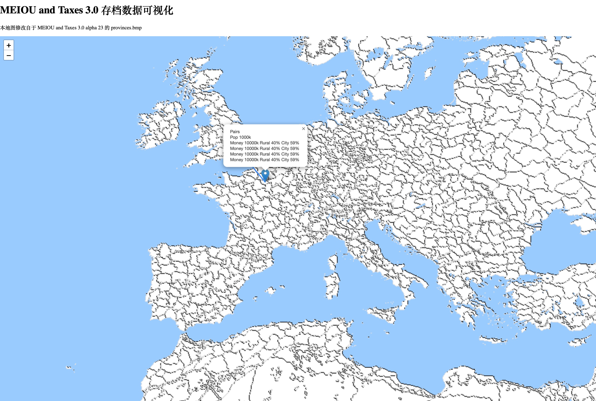

## MT3 数据可视化

## 使用工具

### 地图绘制脚本
通过[export command](./scripts/provinces_bmp_processor.py)处理 provinces.bmp 文件，
可以进行各种游戏内的涂色。

### 存档数据收集脚本
1. 通过 [export.txt](./data-export/export.txt) 将存档内数据导出到 game.log，
2. 通过 python 脚本，处理 game.log，转化为 JSON 格式，生成 JavaScript。

### 存档数据地图可视化展现
使用 JavaScript 库，来将导出的数据展现在网页上，基于 https://leafletjs.coml

### 当前预览效果

上图的代码是 [这是一个 HTML](./demo.html)

## 参考

- <a href="https://meiouandtaxes.miraheze.org/wiki"> MEIOU and Taxes 3.0 Wiki </a>
- <a href="https://leafletjs.coml"> JavaScript Library for Data Visualization </a>
- <a href="https://eu4.paradoxwikis.com/Map_modding#Color_maps"> EU4 wiki for map modding </a>
- <a href="https://pillow.readthedocs.io/en/stable/handbook/image-file-formats.html"> Python Library for image
    processing </a>